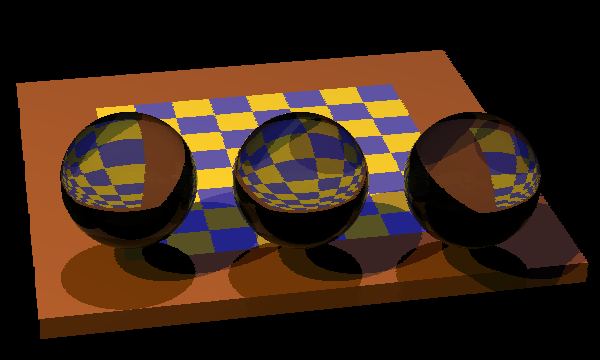
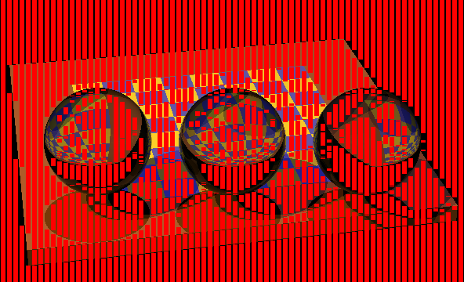
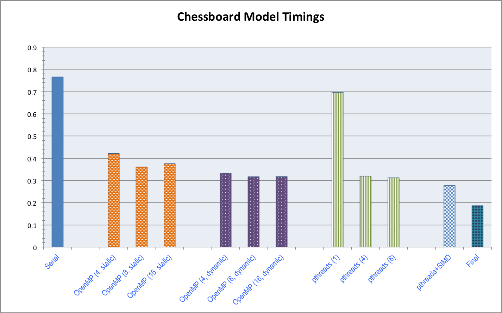

# 15-428 Project: Parallelized Real-Time CPU Raytracing
Jocelyn Huang (jocelynh)

## Summary

My goal was to modify and optimize an existing CPU-based raytracer to run in parallel and at a framerate close to real-time, on a CPU. To get the raytracer up to speed, I explored a few parallelization methods including SIMD instructions and OpenMP, and implementing and researching raytracing-specific optimizations to reduce memory and CPU usage. All benchmarks and the final code were run on my 2011 Macbook Air, which has two cores (four hardware threads).

<!--### Challenges

There were a few major unforseen hurdles in parallelizing the the code, which had made optimizations for serial raytracing that unfortunately created many data dependencies and potential race conditions. This meant that I had to do some major refactoring in order to actually get pthreads working, which involved redesigning the code to remove reuse of data structures between individual rays and getting around class inheritance issues caused by the pthreads library not supporting the execution of C++ member functions. While doing this, I also made some small optimizations for cache locality, including changing some array accesses.

I also had to put some brainpower into animating the scene; the original format was not meant for being animated, as the models are themselves compiled C++ code and the traced scenes were originally just saved to .png images. This involved learning a bit of SDL to begin with, and then when the code was parallelized, figuring where to place synchronization code in order to get each frame rendered without race conditions. (It also turns out that MacOS doesn't actually implement pthread barriers, so that was also an adventure. I ended up borrowing code from [this library](http://blog.albertarmea.com/post/47089939939/using-pthreadbarrier-on-mac-os-x).)

### Preliminary Results

I have managed to get a slightly greater than 2x speedup on my machine, with some benchmarked timing as follows:

|   Type           |  Timing (s)  |
| ---------------- | ------------ |
|Serial Code       |      0.76552 |
| OMP static (4)   |      0.42122 |
| OMP static (8)   |      0.36092 |
| OMP static (16)  |      0.37554 |
| OMP dynamic (4)  |      0.33272 |
| OMP dynamic (8)  |      0.31678 |
| OMP dynamic (16) |      0.31736 |
| pthreads (1)     |      0.69666 |
| pthreads (4)     |      0.31975 |
| pthreads (8)     |      0.31196 |

I ended up switching from OMP to pthreads in order to avoid the overhead of repeatedly spawning and joining instances for every frame; with pthreads, I could simply use a barrier and have the next iteration of calculations starting while the current frame is being written to the screen, which also involved double-buffering so as to not cause screen tearing.
-->

## Background

Raytracing is a common rendering technique that involves computing the paths taken by rays that would hit a "camera lens" in the place of the screen. Since the individual path of any given ray emanating from a pixel of the image is independent of the paths of any other ray, this problem is embarassingly parallel, up until drawing the raytraced image to the screen. Therefore, the bulk of the challenge lies in the computation-heavy nature of the problem, specifically, in speeding a raytracer up to be able to render in real-time. An additional, not insignificant challenge is the constraint of running on a CPU; even if the problem is embarassingly parallel, we are still constrained to having four hardware threads, limiting the amount of true parallelism we can actually enjoy.

To this end, my initial goal is of course to parallelize the raytracing operations for multiple frames of a simple animation using multithreading. However, the main goal of this project is to speed up the CPU implementation enough for the raytracer to run in real-time, so we must of course address ways to hide or reduce the computational load. We notice that there are a few opportunities for instruction-level parallelism in the raytracing algorithm, either across pixels or across colors per pixel, which can be exploited using SIMD execution. There is also opportunity for hiding the latency of copying a buffer to the screen by pipelining operations in a sequence of frames, as drawing to the screen is essentially a serial operation (unless I start trying to parallelize SDL, which is a whole 'nother story). In addition, we can also tweak the code in order to make better use of data cache and to avoid sharing of cache lines in the drawing buffer.

## Approach

As per Kayvon's suggestion, I did not write a raytracer from scratch; instead, I found [an existing CPU-based raytracer by Don Cross](http://www.cosinekitty.com/raytrace/), which is written in C++, to modify and optimize. (Finding a suitable codebase was a bit more time-intensive than I was originally expecting--it's surprisingly hard to find a good raytracer that 1) does not already support multithreading and 2) is not too simplistic.)

To prime the code for my project and to get some reasonable baselines, I had to make a few changes to the code to begin with. The original code implemented antialiasing, which led to each frame taking more than five seconds to complete, so I decided to forego the antialiasing for my implementation. In addition, I had to edit the code to use SDL to draw the image directly to the screen, rather than write to a .png file. The original code also included several optimizations for serial execution which meant that several data structures were shared between pixels, so I took the time to restructure the data structures and functions where needed in order to make them thread-safe after I had taken timings for a serial implementation baseline.

### Baselines

I chose to use the built-in "chessboard" image for my baseline timings, as the code uses models defined in C++ in its raytracing rather than taking in a standard format, and the chessboard was one of the more complex and interesting ones included. This particular image is 600x360 pixels, and the code uses 20 recursive calls as a default, which I kept. The serial code with the original serial optimizations took 0.766 seconds/frame (1.3 fps) averaged over several runs to raytrace for one frame on my machine.

In addition to a serial baseline, I also wrote an OpenMP implementation of the raytracer parallelized across rows of the image, partially as a warm-up and partially to get a baseline for a simple parallel approach, just to get an idea of what sort of speedup I could expect. Timings for these baselines can be found in the Results section below.

*The chessboard image used as a baseline, with no antialiasing.*

### Methods for Speedup

The real meat of my project consisted of trying to get an even better speedup, and for this I used pthreads in order to have more control over synchronization and workload balance, and went through several iterations of improvements. I decided early on to parallelize over interleaved rows, which would more evenly divide the work over threads than chunking the image, since different parts of the image had different complexities depending on whether a ray hit the background rather than an object. I also found that I could reduce pthread creation overhead by using barriers instead of spawning and joining pthreads for each frame, and mitigate a bit of the overhead of parallelizing the raytracer this way.

In order to deal with the serial screen drawing time, I pipelined the raytracing and screen drawing by using double-buffering, such that while the main thread was copying to a buffer and drawing to the screen, other threads would be working on computations for the next frame. Though the time to draw to the screen generally only took about 0.01 seconds, double-buffering hid this extra cost entirely.

Of course, the main bottleneck was the computational cost of recursively raytracing all the pixels in the image. To deal with this, I added SIMD execution of Color operations during raytracing. Each iteration for any given pixel has to perform calculations on the red, green, and blue color values to determine the final color, and since each of these is a floating point operation, I decided to do these in parallel. Since each SIMD vector can hold four doubles, this meant that I had to burn an unused potential operation for every SIMD operation. A nice side-effect of aligning the fields in the Color struct was that it padded out the size of each Color to a clean divisor of a cache line size. However, since much of the existing code was dependent on the Color struct's fields being exactly as they were, I had to work around this by repeatedly loading and storing values into SIMD vectors for every operation, which sadly negated a large part of the potential gain in speedup. Trying to change the struct resulted in more errors from dependencies than I could debug before the project deadline, though I suspect that if the fields were changed to one SIMD vector, the speedup would be considerably better.

With regards to SIMD execution, I did consider vector operations across pixels, but this turned out to not be a great idea; adjacent pixels may hit different object surfaces or even the background, which meant that there would be a lot of potential for divergent execution and loading of several different objects for different pixels' needs. As such, even though the modification to use SIMD in Colors was imperfect, I decided to keep it rather than perform SIMD operations over different pixels.

I also looked into ways of reducing the actual amount of computation workload through heuristics for pixel colors, and found that an "adaptive subsampling" technique was useful in reducing the total number of rays that need to be traced, as part of the computational bound on this problem is the large number of rays to be traced in a single image. Essentially, subsampling takes every few consecutive pixels as sample points, checks if they are close in color, and interpolates between them if they are. I only had time to try subsampling for every four consecutive pixels in each row rather in a square, but this greatly reduced the workload by removing a large number of the computationally intensive raytracing operations.

## Results

### Baselines

As mentioned previously, the original serial code ran at about 0.766 seconds per frame. For my simple parallel baselines, The best performance I achieved with OpenMP was about 0.316 seconds/frame (3.2 fps), a speedup of 2.4x. This is in fact quite reasonable for my two-core machine, as we effectively get two threads with "true" parallelism, with an extra thread helping to hide latency per core, but nothing else. The averaged timings can be seen in the following table.

|  Baseline Type   |  Timing (s)  |
| ---------------- | ------------ |
|Serial Code       |      0.76552 |
| OMP static (4)   |      0.42122 |
| OMP static (8)   |      0.36092 |
| OMP static (16)  |      0.37554 |
| OMP dynamic (4)  |      0.33272 |
| OMP dynamic (8)  |      0.31678 |
| OMP dynamic (16) |      0.31736 |

### Final Speedups and Results

I measured performance using time between frame updates, and compared these times to the baseline timings. Speedup was measured simply as original time/improved time. To get a visual cue of how I was doing throughout the project, I animated the chessboard to zoom in and out and ran timings on each frame of the animation.

With the optimized pthreads and SIMD, a raytracer utilizing four pthreads ran at about 0.277 seconds per frame (3.6 fps), a speedup of 2.8x over the serial version. Due to the interleaving of rows, workload balance was quite good, and even without SIMD was faster than the dynamic OpenMP code. Unfortunately, since I couldn't change the Color struct as mentioned above, the overhead loading and storing the RGB values of each pixel for every SIMD operation cost a large part of the potential speedup. This meant that though this version of the code was better than the original OpenMP version, I ended up trading a significant amount of computational cost for memory bandwidth cost--according to the intruction latency tables published by Dr. Agner Fog (of the Technical University of Denmark), vector loads and stores using pointers as well as vector broadcasts take four cycles, as opposed to the original code which could operate much faster using registers.

The biggest gain in speedup came with actually reducing the number of pixels that had to be raytraced through subsampling, which didn't sacrifice noticeable image clarity. The following image shows in garish red the actual pixels that were be skipped in that frame of the animation, thereby saving the computational cost of recursively raytracing for each. Notice that the majority of the image can now be directly interpolated from previous computations, which cuts down drastically on the main bottleneck!

*The red indicates pixels that did not need to be raytraced under subsampling, saving computation time.*

In the end, four pthreads with SIMD execution and subsampling could produce a raytraced image in 0.177 seconds (5.7 fps), a speedup of 4.3x the original serial code, and 1.8x over the best OpenMP implementation. A graph of the times it took to raytrace each frame over each of my implementations is shown below, with the final (and fastest) implementation being the one using pthreads, SIMD, and subsampling. Drawing to the screen takes approximately 1/10 of the time to raytrace, so we know that the bottleneck now occurs in the memory accesses due to the SIMD loads and stores, as well as the loads and stores to the pixel data buffer, as mentioned above.

*Graph showing all timings, side-by-side. Parentheses indicate number of threads for that particular implementation.*

Of course, a GPU, which can run hundreds of threads in parallel, would have a much better time of parallelizing raytracing, but I wanted to see how much faster I could make a CPU implementation, as a good number of laptops have integrated GPUs that are not easy to program for. As a result, we are still compute bound, though much less so with subsampling, with some of the computation traded for memory accesses of saved results and overhead of checking differences. At this point, the majority of the latency comes from excess memory operations incurred by trying to convert Color values to SIMD vectors--at best, only one in four pixels need to be raytraced, with at least 40 loads or stores per frame per pixel, while interpolated pixels only require four stores, one per color channel. This could potentially be improved by a significant refactoring of the original code structure, which I considered attempting briefly before realizing how much of the code broke as a consequence.

## Possible Improvements
- Add shared data structures per thread to mitigate overhead of creating and destroying them per pixel (implemented before in the serial code, but removed for thread safety).
- Improve SIMD for the Color struct by doing a full overhaul of the struct, and making its fields vectors. This would also entail modifying all code that accesses the struct's color values and making slight adjustments to the SIMD execution of Color operations.
- Perform subsampling in 2D, and perhaps implement adaptive subsampling (halving the size of the subsampled region repeatedly if needed).

## References
- [Fundamentals of Ray Tracing (Don Cross)](http://www.cosinekitty.com/raytrace/), the codebase I used
- [Adaptive Subsampling (Web Archive)](https://web-beta.archive.org/web/20100923081853/http://www.exceed.hu/h7/subsample.htm)
- [Intel Intrinsics Guide](https://software.intel.com/sites/landingpage/IntrinsicsGuide/)
- [StackOverflow timing code](http://stackoverflow.com/questions/1861294/how-to-calculate-execution-time-of-a-code-snippet-in-c)
- [Instruction Latency Tables](http://agner.org/optimize/instruction_tables.pdf)
